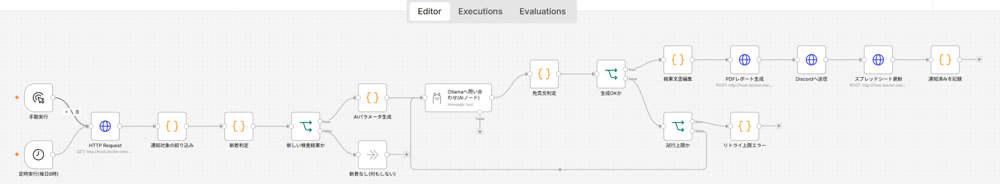
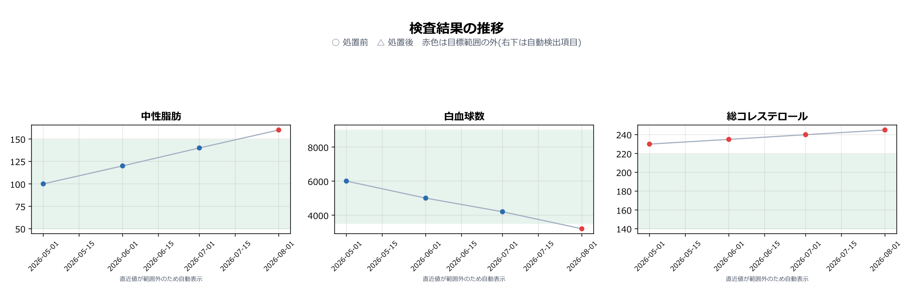
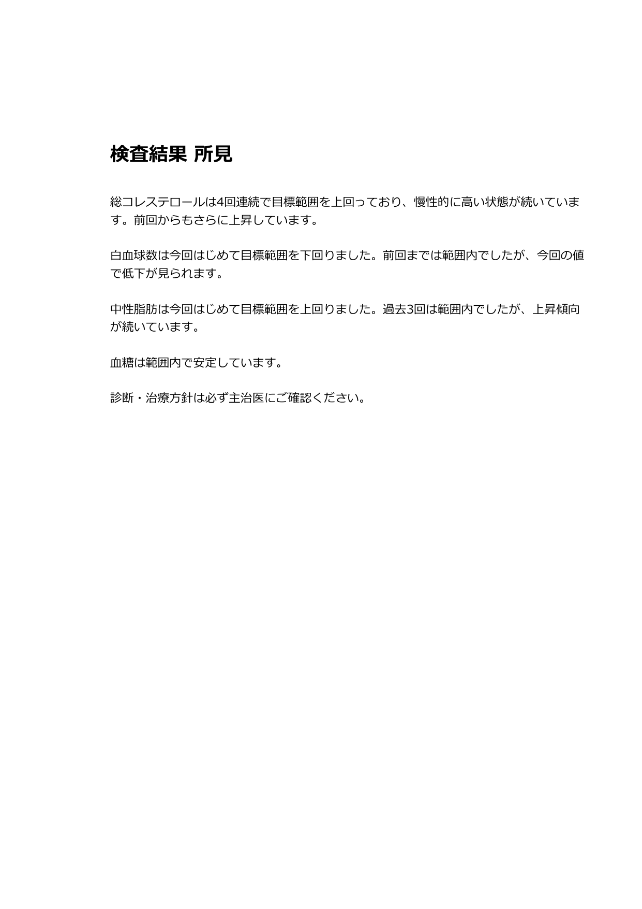
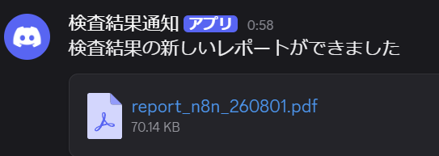

# 検査結果解析AI(n8n版)

[検査結果解析AI](https://github.com/m3yama/kensa-kekka-ai)(Dify版)と対になる、監視・通知を担当するn8nワークフロー。

Dify版が「撮影 → OCR → LLM転記 → DB保存」というデータの取り込みを担当するのに対し、
本ワークフローは**保存済みのデータを毎日自動で確認し、新しい検査結果があれば
所見コメントとレポートを生成して通知する**役割を担う。

## 処理の流れ

```
定時実行(毎日8時) / 手動実行
  → HTTP Request(/trend_n8n から最新の検査結果を取得)
  → 新着判定 → 新しい検査結果か
       ├─ No  → 新着なし(何もしない)
       └─ Yes → AIパラメータ生成 → Ollamaへ問い合わせ(AIノード)
                  → 生成OKか(NGなら試行上限までリトライ)
                  → 免責文判定 → 結果文書編集 → PDFレポート生成
                  → スプレッドシート更新
                  → 通知対象の絞り込み → Discordへ送信
                  → 通知済みを記録
```



## 役割分担

| 項目 | Dify版(kensa-kekka-ai) | n8n版(本リポジトリ) |
|---|---|---|
| 用途 | 対話型(検査票の取り込み) | 監視通知型(定時実行) |
| 入力 | 検査報告書の写真 | Dify版が保存したDB |
| 出力 | DB保存 | 所見コメント・PDFレポート・Discord通知・スプレッドシート更新 |

## 構成

ワークフローはn8nコンテナ内のSQLiteで管理しており、本リポジトリでは以下の2ファイルのみを管理する。

- `kensa-kekka-report.json` — エクスポートしたワークフロー定義。n8nの画面から「Import from File」で読み込むことで復元できる
- `seed.sql` — 動作確認用のテストデータ(下記)

バックエンド(FastAPI、`/trend_n8n`等)はDify版と共通のため、[kensa-kekka-ai](https://github.com/m3yama/kensa-kekka-ai)を参照。

## テスト用データ

`seed.sql`で動作確認用のダミーデータを用意している。

- 慢性的に基準値外(総コレステロール)
- 今回はじめて基準値外になった(白血球数・中性脂肪)
- 常に範囲内で通知対象から除外される(血糖)

```bash
sqlite3 lab_results_n8n.db < seed.sql
```

このデータから生成したPDFレポート(1ページ目: 推移グラフ、2ページ目: AIによる所見コメント)。




このレポートがDiscordに届いたときの通知。



## 使用技術

- n8n (ワークフロー自動化、Docker)
- FastAPI（バックエンドAPI）
- SQLite（検査結果データ管理）
- Ollama (所見コメント生成)
- Google Sheets API (記録更新)
- PDF（レポート生成）
- Discord Webhook (通知)

---

## 注意事項

- 本システムが生成する所見は**医療アドバイスではない**。診断・治療方針は主治医の判断による
- 本ワークフローが行うのはOllamaでの所見生成と、Discord・スプレッドシートへの通知のみ。
  検査データの取り込み・保存は行わない(Dify版の担当)。外部に出るのはDiscord WebhookとGoogle
  スプレッドシートへの通知内容のみ


